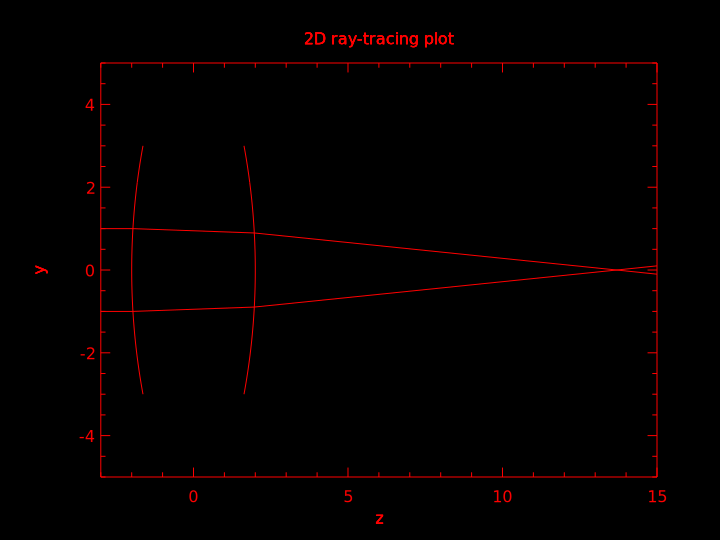

# Ray Tracing

This program implements the core algorithm of sequential ray-tracing. 
Instead of using ray transfer matrix (a.k.a. ABCD matrix), this program uses differential geometry, 
which can cope with any parameterizable surfaces.




## Installation and build

The following install procedures only tested on Ubuntu Linux

- Clone this repo with ```--recurse-submodules```
- Download BOOST library
- Add cmake parameter ```-DBOOST_ROOT=/your/boost/library```
- Download and add Eigen library
- Install plplot: ```sudo apt-get install libplplot-dev``` ```pkg-config --cflags --libs plplot-c++```
- Install yaml-cpp:
  - Download [yaml-cpp](https://github.com/jbeder/yaml-cpp)
  - Make a ```./build``` directory
  - Run ```cmake ..```
  - Run ```make``` and then ```sudo make install```.
 or ```sudo apt-get install libyaml-cpp-dev```
 
## Dependencies

This software builds with googletest and eigen, please make sure you add ```--recurse-submodules``` 
when cloning the repo, i.e.,
```bash
git clone https://github.com/kanhua/cpp-raytracing.git --recurse-submodules
```
 
This software requires the following external libraries

#### Boost
 Download Boost and set ```-DBOOST_ROOT=/your/boost/library``` when running cmake.
 
#### plplot

Use apt-get: 
```sudo apt-get install libplplot-dev``` 
then check if the package exists by:
```pkg-config --cflags --libs plplot-c++``` or
```pkg-config --cflags --libs plplotd-c++```

#### yaml-cpp

Use ```sudo apt-get install libyaml-cpp-dev```

Alternatively:
  - Downlaod [yaml-cpp](https://github.com/jbeder/yaml-cpp)
  - Make a ```./build``` directory
  - Run ```cmake ..```
  - Run ```make``` and then ```sudo make install```.
  
## Build

In the root folder of this repo:

```bash
mkdir build
cd build
cmake ..
make
```

## Run the program

In ```build``` directory, run the command ```cpp-raytracing``` using the following usage
```
./cpp-raytracing [config_filename]
```

```config_filename``` is a yaml file that sets the lenses and the rays parameters for the program to run.


For example:

```$xslt
./cpp-raytracing ../examples/single_biconvex_lens.yaml
```
Upon successful run, this program should generate a SVG file that plots the ray tracing results.


## Project Rubrics

### Loops, Functions, I/O
- The project demonstrates an understanding of C++ functions and control structures.
- The project reads data from a file and process the data, or the program writes data to a file.

### Object-Oriented Programming
- The project uses Object Oriented Programming techniques.
- Classes use appropriate access specifiers for class members.
- Templates generalize functions in the project.

### Memory management
- The project makes use of references in function declarations.
- The project uses smart pointers instead of raw pointers.
